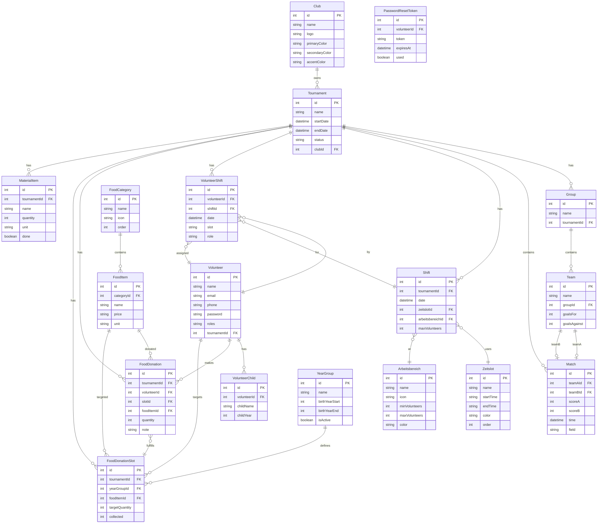

# ⚽ Turnier-Planer

Webanwendung zur Planung von Fußballturnieren, Verwaltung von Helfer-Dienstplänen und Koordination von Lebensmittel-Spenden.

## Features
- ✅ Turniere, Gruppen & Spielplan erstellen
- ✅ Ergebnisse live pflegen
- 👥 Wochen-Dienstplan für Helfer mit Drag & Drop
- 🍞 Lebensmittel-Spendenmanagement (Jahrgang-basiert)
- 🏅 Vereinsbranding (3-Farben-Theming + Logo)
- 🔐 SelfService-Portal für Helfer (Login, Buchung, Spenden)
- 📧 Passwort-zurücksetzen per E-Mail (Resend)
- 🐳 Dockerized (Backend + Frontend)
- 🚀 GitHub Actions CI/CD Pipeline

---

## Architektur

```
┌─────────────────────────────────────────────────────────┐
│                    Benutzer / Browser                     │
└──────────────┬──────────────────────────────┬───────────┘
               │                              │
    ┌──────────▼──────────┐        ┌─────────▼──────────┐
    │  turnier-planer.     │        │  turnier-planer-   │
    │  mygate.dedyn.io     │        │  admin.mygate...   │
    │                      │        │                     │
    │  SelfServiceView     │        │  AdminView (App)   │
    │  (Helfer-Portal)     │        │  (Admin-Bereich)   │
    └──────────┬───────────┘        └─────────┬──────────┘
               │                              │
               ▼                              │
    ┌──────────────────────┐                   │
    │   Vite Dev / Nginx   │                   │
    │   (Frontend Build)   │                   │
    └──────────┬───────────┘                   │
               │                                │
               ▼                                │
    ┌──────────────────────┐                   │
    │  Express + tsx       │◄──────────────────┘
    │  (Backend API)       │
    │  Port: 5000          │
    └──────────┬───────────┘
               │
               ▼
    ┌──────────────────────┐
    │   SQLite (dev.db)    │
    │   Prisma ORM         │
    └──────────────────────┘
```

### Tech Stack

| Schicht       | Technologie                          |
|---------------|--------------------------------------|
| Frontend      | React 18 + Vite + TypeScript         |
| Backend       | Express.js + tsx (TypeScript Runtime)|
| Datenbank     | SQLite + Prisma ORM                  |
| Auth          | JWT (`jsonwebtoken`) + bcrypt        |
| E-Mail        | Resend API                           |
| Deployment    | Docker Compose + GitHub Actions      |
| CI/CD         | GHCR (GitHub Container Registry)     |

### Zwei Ansichten über URL-Routing

Die Anwendung bietet zwei getrennte Oberflächen, die **über eine einzige Domain** gesteuert werden:

| URL | Ansicht | Zielgruppe |
|-----|---------|------------|
| `https://turnier-planer.mygate.dedyn.io` | SelfServiceView | Helfer |
| `?view=admin` Query-Parameter | Admin (App.tsx) | Administration |

---

## ER-Modell



### Datenmodell-Übersicht

| Modell | Beschreibung |
|--------|-------------|
| **Club** | Verein mit Logo und 3-Farben-Theming (Primary/Secondary/Accent) |
| **Tournament** | Turnier mit Status (aktiv/beendet/archiviert), verknüpft mit Club |
| **Group / Team** | Gruppenphase: Groups enthalten Teams, Teams spielen Matches |
| **Match** | Begegnung zwischen zwei Teams mit Ergebnis und Feld/Zeit |
| **Arbeitsbereich** | Physischer Station (Verkaufsstand, Grillstand, etc.) mit Min/Max Helfer |
| **Zeitslot** | Zeitfenster (Start/Ende) für Schichten |
| **Shift** | Konkreter Job-Slot: Datum × Zeitslot × Arbeitsbereich |
| **Volunteer** | Helferin/Helfer mit Login-Daten, Rollen und Kinder-Informationen |
| **VolunteerChild** | Kind einer Helferin (Name + Jahrgang) für Spendenfilterung |
| **VolunteerShift** | Zuweisung: Wer ist wann in welcher Schicht? |
| **FoodCategory / FoodItem** | Lebensmittel-Kategorien und -Artikel mit Preisen |
| **YearGroup** | Jahrgang (Geburtsjahr-Bereich) für zielgruppengerechte Spendenplanung |
| **FoodDonationSlot** | Zielmenge pro Artikel + Jahrgang, wird durch Spenden gefüllt |
| **FoodDonation** | Konkrete Spende einer Helferin (verknüpft mit Slot oder frei) |
| **MaterialItem** | Materialliste für das Turnier |
| **PasswordResetToken** | Token-basiertes Passwort-zurücksetzen |

---

## Data Dictionary

### 🏅 Club (Verein)
| Feld | Typ | Nullable | Beschreibung |
|------|-----|----------|-------------|
| `id` | Int (PK) | ❌ | Primärschlüssel |
| `name` | String | ❌ | Vereinsname |
| `logo` | String | ✅ | Logo als Base64-DataURI |
| `primaryColor` | String | ❌ | Hauptfarbe (#hex), Header/Gradients |
| `secondaryColor` | String | ❌ | Sekundärfarbe (#hex), Buttons/Akzente |
| `accentColor` | String | ❌ | Akzentfarbe (#hex), Status/Highlights |

### 🏟️ Tournament (Turnier)
| Feld | Typ | Nullable | Beschreibung |
|------|-----|----------|-------------|
| `id` | Int (PK) | ❌ | Primärschlüssel |
| `name` | String | ❌ | Turniername |
| `description` | String | ✅ | Beschreibung/Details |
| `startDate` | DateTime | ❌ | Erster Turniertag |
| `endDate` | DateTime | ❌ | Letzter Turniertag |
| `status` | String | ❌ | `aktiv` / `beendet` / `archiviert` |
| `clubId` | Int (FK) | ✅ | Verknüpfter Verein → Club.id |

### 👥 Group (Gruppe)
| Feld | Typ | Nullable | Beschreibung |
|------|-----|----------|-------------|
| `id` | Int (PK) | ❌ | Primärschlüssel |
| `name` | String | ❌ | Gruppenname (z.B. "Gruppe A") |
| `tournamentId` | Int (FK) | ❌ | Gehört zu → Tournament.id |

### ⚽ Team (Mannschaft)
| Feld | Typ | Nullable | Beschreibung |
|------|-----|----------|-------------|
| `id` | Int (PK) | ❌ | Primärschlüssel |
| `name` | String | ❌ | Mannschaftsname |
| `groupId` | Int (FK) | ❌ | Gehört zu → Group.id |
| `goalsFor` | Int | ❌ | Erzielte Tore |
| `goalsAgainst` | Int | ❌ | Gegene Tore |

### 📋 Match (Begegnung)
| Feld | Typ | Nullable | Beschreibung |
|------|-----|----------|-------------|
| `id` | Int (PK) | ❌ | Primärschlüssel |
| `tournamentId` | Int (FK) | ❌ | Gehört zu → Tournament.id |
| `teamAId` | Int (FK) | ❌ | Team A → Team.id |
| `teamBId` | Int (FK) | ❌ | Team B → Team.id |
| `scoreA` | Int | ✅ | Ergebnis Team A (null = ausstehend) |
| `scoreB` | Int | ✅ | Ergebnis Team B (null = ausstehend) |
| `field` | String | ❌ | Spielfeld (Standard: "Feld 1") |
| `time` | DateTime | ❌ | Angesetzt Spielzeit |

### 👤 Volunteer (Helferin/Helfer)
| Feld | Typ | Nullable | Beschreibung |
|------|-----|----------|-------------|
| `id` | Int (PK) | ❌ | Primärschlüssel |
| `name` | String | ❌ | Vollständiger Name |
| `email` | String | ✅ | E-Mail-Adresse (Login/Passwort-Zurücksetzen) |
| `phone` | String | ✅ | Telefonnummer |
| `childName` | String | ✅ | Name des eigenen Kindes (bei Registrierung) |
| `childYear` | Int | ✅ | Jahrgang des eigenen Kindes (bei Registrierung) |
| `password` | String | ✅ | bcrypt-Hash (optional, nur bei Registrierung gesetzt) |
| `roles` | String | ❌ | JSON-Array als String: `["admin","helper"]` |
| `tournamentId` | Int (FK) | ✅ | Aktuelles Turnier → Tournament.id |

### 👶 VolunteerChild (Kind einer Helferin)
| Feld | Typ | Nullable | Beschreibung |
|------|-----|----------|-------------|
| `id` | Int (PK) | ❌ | Primärschlüssel |
| `volunteerId` | Int (FK) | ❌ | Gehört zu → Volunteer.id |
| `childName` | String | ❌ | Name des Kindes |
| `childYear` | Int | ❌ | Geburtsjahr (z.B. 2015 für Jahrgang 2013) |

### 📅 VolunteerShift (Helfer-Einsatz)
| Feld | Typ | Nullable | Beschreibung |
|------|-----|----------|-------------|
| `id` | Int (PK) | ❌ | Primärschlüssel |
| `volunteerId` | Int (FK) | ❌ | Helferin/Helfer → Volunteer.id |
| `shiftId` | Int (FK) | ✅ | Konkreter Job-Slot → Shift.id |
| `date` | DateTime | ❌ | Einsatzdatum |
| `slot` | String | ❌ | Zeitslot-Name (z.B. "09:00–12:00") |
| `role` | String | ❌ | Rolle/Aufgabe |

### 📍 Arbeitsbereich (Station)
| Feld | Typ | Nullable | Beschreibung |
|------|-----|----------|-------------|
| `id` | Int (PK) | ❌ | Primärschlüssel |
| `name` | String | ❌ | Name (z.B. "Verkaufsstand", "Grillstand") |
| `icon` | String | ❌ | Emoji-Icon (Standard: "📍") |
| `minVolunteers` | Int | ❌ | Mindestanzahl Helfer (Default: 2) |
| `maxVolunteers` | Int | ❌ | Maximalanzahl Helfer (Default: 8) |
| `color` | String | ❌ | Farbwert für UI-Badges (#hex) |

### ⏰ Zeitslot (Zeitfenster)
| Feld | Typ | Nullable | Beschreibung |
|------|-----|----------|-------------|
| `id` | Int (PK) | ❌ | Primärschlüssel |
| `name` | String | ❌ | Anzeigename (z.B. "Morgen") |
| `startTime` | String | ❌ | Startzeit (ISO 8601: "09:00") |
| `endTime` | String | ❌ | Endzeit (ISO 8601: "12:00") |
| `color` | String | ❌ | Farbwert für UI (#hex) |
| `order` | Int | ❌ | Sortierreihenfolge (Default: 0) |

### 🔧 Shift (Job-Slot)
| Feld | Typ | Nullable | Beschreibung |
|------|-----|----------|-------------|
| `id` | Int (PK) | ❌ | Primärschlüssel |
| `tournamentId` | Int (FK) | ❌ | Gehört zu → Tournament.id |
| `date` | DateTime | ❌ | Einsatzdatum |
| `zeitslotId` | Int (FK) | ✅ | Zeitfenster → Zeitslot.id |
| `arbeitsbereichId` | Int (FK) | ✅ | Station → Arbeitsbereich.id |
| `maxVolunteers` | Int | ❌ | Max. Helfer (Default: 8, überschreibt Arbeitsbereich) |

### 📂 FoodCategory (Lebensmittel-Kategorie)
| Feld | Typ | Nullable | Beschreibung |
|------|-----|----------|-------------|
| `id` | Int (PK) | ❌ | Primärschlüssel |
| `name` | String | ❌ | Kategoriename (z.B. "Kuchen", "Getränke") |
| `icon` | String | ❌ | Emoji-Icon (Standard: "🍽️") |
| `order` | Int | ❌ | Sortierreihenfolge (Default: 0) |

### 🍰 FoodItem (Lebensmittel-Artikel)
| Feld | Typ | Nullable | Beschreibung |
|------|-----|----------|-------------|
| `id` | Int (PK) | ❌ | Primärschlüssel |
| `categoryId` | Int (FK) | ❌ | Kategorie → FoodCategory.id |
| `name` | String | ❌ | Artikelname (z.B. "Selbstgemachter Kuchen") |
| `price` | String | ✅ | Preisangabe (optional) |
| `unit` | String | ❌ | Einheit (Default: "Stk") |

### 🎓 YearGroup (Jahrgang)
| Feld | Typ | Nullable | Beschreibung |
|------|-----|----------|-------------|
| `id` | Int (PK) | ❌ | Primärschlüssel |
| `name` | String | ❌ | Anzeigename (z.B. "Jahrgang 2013") |
| `birthYearStart` | Int | ❌ | Startjahr der Altersgruppe |
| `birthYearEnd` | Int | ❌ | Endjahr der Altersgruppe |
| `order` | Int | ❌ | Sortierreihenfolge (Default: 0) |
| `isActive` | Boolean | ❌ | Aktiv/Inaktiv (Default: true) |

### 🎯 FoodDonationSlot (Spenden-Ziel)
| Feld | Typ | Nullable | Beschreibung |
|------|-----|----------|-------------|
| `id` | Int (PK) | ❌ | Primärschlüssel |
| `tournamentId` | Int (FK) | ❌ | Gehört zu → Tournament.id |
| `yearGroupId` | Int (FK) | ✅ | Ziel-Jahrgang → YearGroup.id |
| `foodItemId` | Int (FK) | ✅ | Gewünschter Artikel → FoodItem.id |
| `targetQuantity` | Int | ❌ | Zielmenge (Default: 0) |
| `collected` | Int | ❌ | Aktuelle gespendete Menge (wird automatisch inkrementiert) |

### 📦 FoodDonation (Konkrete Spende)
| Feld | Typ | Nullable | Beschreibung |
|------|-----|----------|-------------|
| `id` | Int (PK) | ❌ | Primärschlüssel |
| `tournamentId` | Int (FK) | ❌ | Gehört zu → Tournament.id |
| `volunteerId` | Int (FK) | ❌ | Spender:in → Volunteer.id |
| `foodDonationSlotId` | Int (FK) | ✅ | Verknüpfter Slot → FoodDonationSlot.id |
| `foodItemId` | Int (FK) | ❌ | Gespendeter Artikel → FoodItem.id |
| `quantity` | Int | ❌ | Menge |
| `note` | String | ✅ | Notiz/Freitext |

### 📋 MaterialItem (Materialgegenstand)
| Feld | Typ | Nullable | Beschreibung |
|------|-----|----------|-------------|
| `id` | Int (PK) | ❌ | Primärschlüssel |
| `tournamentId` | Int (FK) | ❌ | Gehört zu → Tournament.id |
| `name` | String | ❌ | Gegenstandsname |
| `quantity` | Int | ❌ | Menge (Default: 1) |
| `unit` | String | ❌ | Einheit (Default: "Stk") |
| `done` | Boolean | ❌ | Abgehakt/Erledigt (Default: false) |

### 🔑 PasswordResetToken (Passwort-Zurücksetzen)
| Feld | Typ | Nullable | Beschreibung |
|------|-----|----------|-------------|
| `id` | Int (PK) | ❌ | Primärschlüssel |
| `volunteerId` | Int (FK) | ❌ | Gehört zu → Volunteer.id |
| `token` | String | ❌ | Einmaliger Reset-Token (unique) |
| `expiresAt` | DateTime | ❌ | Ablaufzeit des Tokens |
| `used` | Boolean | ❌ | Bereits verwendet (Default: false) |

---

## Lokaler Start

```bash
# Dependencies installieren
cd backend && npm install && cd ..
cd frontend && npm install && cd ..

# Datenbank initialisieren
cd backend && npx prisma db push && cd ..

# Server starten
docker compose up --build
```

🔗 Frontend: http://localhost:8080  
🔗 Backend API: http://localhost:5000

---

## Deployment (GitHub Secrets erforderlich)
- `DEPLOY_USER` = SSH Benutzername des Zielservers
- `DEPLOY_HOST` = IP oder Domain des Zielservers

Push nach `master` → GitHub Actions baut & pusht die Images → Pullt sie auf dem Server.

### Zugriff über eine einzige Domain
Alle Funktionen sind über **eine Subdomain** erreichbar – die Ansicht wird per Query-Parameter gesteuert:

| URL | Ansicht |
|-----|---------|
| `https://turnier-planer.mygate.dedyn.io` | SelfServiceView (Helfer-Portal) |
| `https://turnier-planer.mygate.dedyn.io?view=admin` | Admin-Bereich |

**Vorteil:** Keine zweite Subdomain oder DNS-Einträge nötig. Admin-Zugriff direkt über URL-Parameter.

---

## Anpassung
Pass bei Bedarf die Felder, Rollen und Zeitslots in den Komponenten an.  
Die SQLite-Datenbank bleibt automatisch persistent über Docker Volumes.

---
Macht das Turnier! ⚽🏆
